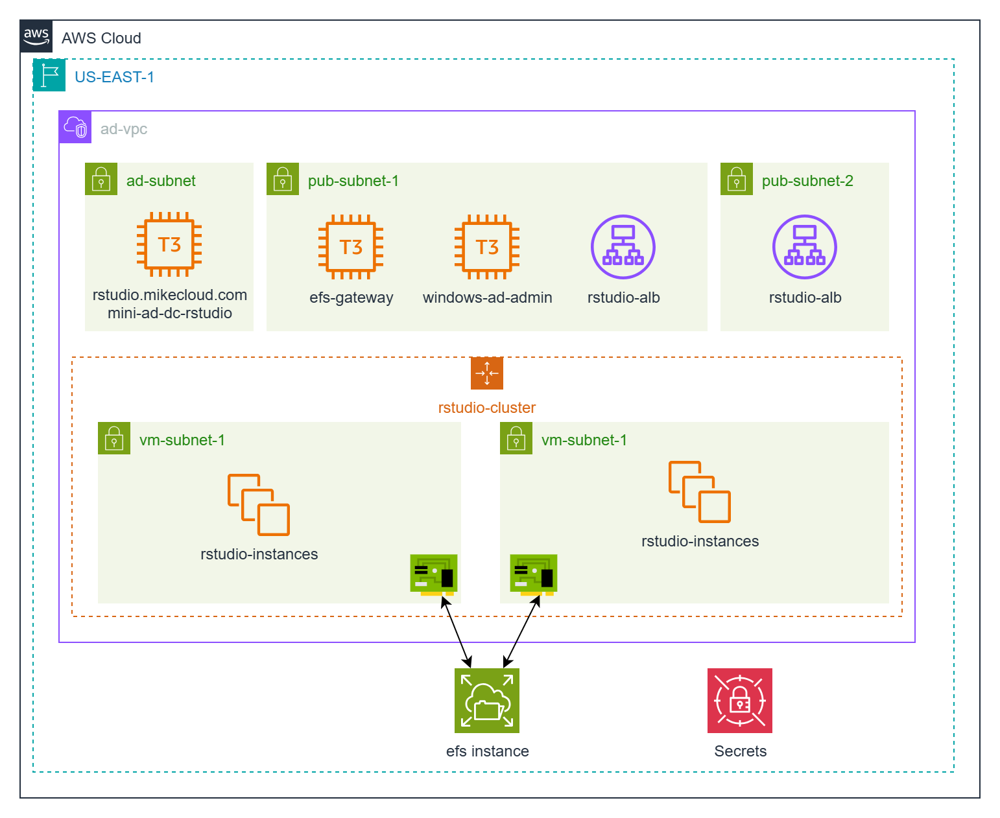
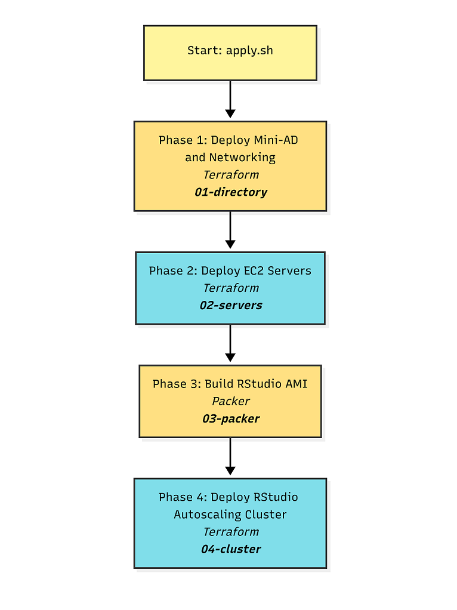
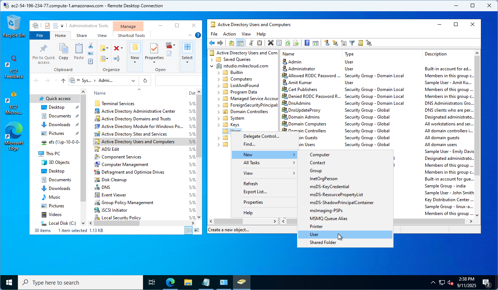
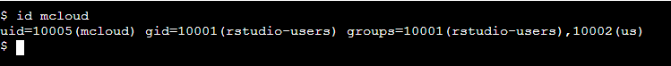

# AWS RStudio Cluster with EFS-Backed Shared Libraries

This project extends the original **AWS Mini Active Directory** lab by deploying an **RStudio Server cluster** on Amazon Web Services (AWS). The cluster is designed for data science and analytics workloads, where multiple users need a scalable, domain-joined environment with consistent package management.

Instead of relying only on per-user libraries stored on ephemeral instance disks, this solution integrates **Amazon Elastic File System (EFS)** as a shared package and data backend. This allows RStudio nodes in an Auto Scaling Group (ASG) to mount a common EFS location, ensuring that installed R packages and project files are accessible across all nodes.

Key capabilities demonstrated:

1. **RStudio Server Cluster with Load Balancer** – RStudio Server (Open Source Edition) deployed across multiple EC2 instances, fronted by an Application Load Balancer (ALB) for high availability and seamless user access.  
2. **EFS-Backed Shared Library** – EFS mounted at `/efs/rlibs` and injected into `.libPaths()`, enabling shared R package storage across the cluster.  
3. **Mini Active Directory Integration** – A Samba-based mini-AD domain controller provides authentication and DNS, so RStudio logins are domain-based and centrally managed.  

Together, this architecture provides a reproducible, cloud-native RStudio environment where users get both personal home-directory libraries and access to a shared, scalable package repository.



## Prerequisites

* [An AWS Account](https://aws.amazon.com/console/)
* [Install AWS CLI](https://docs.aws.amazon.com/cli/latest/userguide/getting-started-install.html) 
* [Install Latest Terraform](https://developer.hashicorp.com/terraform/install)

If this is your first time watching our content, we recommend starting with this video: [AWS + Terraform: Easy Setup](https://youtu.be/BCMQo0CB9wk). It provides a step-by-step guide to properly configure Terraform, Packer, and the AWS CLI.


## Build WorkFlow




## Download this Repository

```bash
git clone https://github.com/mamonaco1973/aws-rstudio-cluster.git
cd aws-rstudio-cluster
```

## Build the Code

Run [check_env](check_env.sh) to validate your environment, then run [apply](apply.sh) to provision the infrastructure.

```bash
develop-vm:~/aws-rstudio-cluster$ ./apply.sh
NOTE: Validating that required commands are found in your PATH.
NOTE: aws is found in the current PATH.
NOTE: terraform is found in the current PATH.
NOTE: All required commands are available.
NOTE: Checking AWS cli connection.
NOTE: Successfully logged into AWS.
Initializing the backend...
Initializing provider plugins...
- Reusing previous version of hashicorp/random from the dependency lock file
- Reusing previous version of hashicorp/aws from the dependency lock file
- Using previously-installed hashicorp/random v3.7.1
- Using previously-installed hashicorp/aws v5.89.0

Terraform has been successfully initialized!

You may now begin working with Terraform. Try running "terraform plan" to see
any changes that are required for your infrastructure. All Terraform commands
should now work.
```
### Build Results

When the deployment completes, the following resources are created:

- **Networking:**  
  - A VPC with public and private subnets  
  - Internet Gateway and NAT Gateway for controlled outbound access  
  - Route tables configured to direct traffic through NAT for private subnets  
  - DNS resolution provided by the Mini-AD domain controller  

- **Security & IAM:**  
  - Security groups for the domain controller, RStudio cluster nodes, ALB, and EFS mount targets  
  - IAM roles and instance profiles enabling EC2 nodes to use AWS Systems Manager and mount EFS  
  - Secrets stored in AWS Secrets Manager for AD administrator and RStudio test user credentials  

- **Active Directory Server:**  
  - Ubuntu EC2 instance running Samba 4 as a Domain Controller and DNS server  
  - Configured Kerberos realm and NetBIOS name for centralized authentication  
  - Integrated with the RStudio cluster for domain-based logins  

- **Amazon EFS:**  
  - Elastic File System provisioned with mount targets in each private subnet  
  - Security group allowing NFS traffic (TCP/2049) from RStudio nodes  
  - Mounted at `/efs/rlibs` and injected into `.libPaths()` for shared R package storage  

- **Custom RStudio AMI:**  
  - Built with Packer to include R, RStudio Server (Open Source Edition), and bootstrap scripts  
  - Configured to integrate with domain authentication  
  - Ready for deployment across the autoscaling cluster  

- **RStudio Autoscaling Cluster:**  
  - Auto Scaling Group of EC2 instances using the custom AMI  
  - Application Load Balancer (ALB) distributing traffic to RStudio nodes  
  - Domain-joined at launch, with consistent access to EFS-backed shared libraries  
  - Provides high availability and elasticity for R workloads  

- **Validation:**  
  - Automated checks via `./validate.sh` confirm DNS resolution, AD integration, and cluster health  
  - Ensures that users can log in through the ALB and access both personal and shared R libraries  

### Users and Groups

As part of this project, when the domain controller is provisioned, a set of sample **users** and **groups** are automatically created through Terraform-provisioned scripts running on the mini-ad server. These resources are intended for **testing and demonstration purposes**, showcasing how to automate user and group provisioning in a self-managed Active Directory environment.


#### Groups Created

| Group Name    | Group Category | Group Scope | gidNumber |
|---------------|----------------|-------------|-----------|
| rstudio-users  | Security       | Universal   | 10001     |
| india         | Security       | Universal   | 10002     |
| us            | Security       | Universal   | 10003     |
| linux-admins  | Security       | Universal   | 10004     |
| rstudio-admins  | Security       | Universal   | 10005     |

#### Users Created and Group Memberships

| Username | Full Name   | uidNumber | gidNumber | Groups Joined                    |
|----------|-------------|-----------|-----------|-----------------------------------|
| jsmith   | John Smith  | 10001     | 10001     | rstudio-users, us, linux-admins,rstudio-admins    |
| edavis   | Emily Davis | 10002     | 10001     | rstudio-users, us                  |
| rpatel   | Raj Patel   | 10003     | 10001     | rstudio-users, india, linux-admins, rstudio-admins |
| akumar   | Amit Kumar  | 10004     | 10001     | rstudio-users, india               |

---

#### Understanding `uidNumber` and `gidNumber` for Linux Integration

The **`uidNumber`** (User ID) and **`gidNumber`** (Group ID) attributes are critical when integrating **Active Directory** with **Linux systems**, particularly in environments where **SSSD** ([System Security Services Daemon](https://sssd.io/)) or similar services are used for identity management. These attributes allow Linux hosts to recognize and map Active Directory users and groups into the **POSIX** (Portable Operating System Interface) user and group model.

---

### Log into Windows Instance  

When the Windows instance boots, the [userdata script](02-servers/scripts/userdata.ps1) executes the following tasks:  

- Install Active Directory Administrative Tools  
- Install AWS CLI  
- Join EC2 instance to Active Directory  
- Grant RDP access to domain users  
- Perform a final system reboot  

Administrator credentials are stored in the `rpatel_ad_credentials` secret.



---

### Log into Linux Instance  

When the Linux instance boots, the [userdata script](02-servers/scripts/userdata.sh) runs the following tasks:  

- Update OS and install required packages  
- Install AWS CLI  
- Join the Active Directory domain with SSSD  
- Enable password authentication for AD users  
- Configure SSSD for AD integration  
- Grant sudo privileges to the `linux-admins` group  
- Sets up Samba and shares `/efs` for Windows access to EFS

Linux user credentials are stored as secrets.



---

### Clean Up Infrastructure  

When you are finished testing, you can remove all provisioned resources with:  

```bash
./destroy.sh
```

This will use Terraform to delete the VPC, EC2 instances, IAM roles, security groups, and any other infrastructure created by the project. Secrets stored in AWS Secrets Manager will also be deleted unless retention policies are configured.
